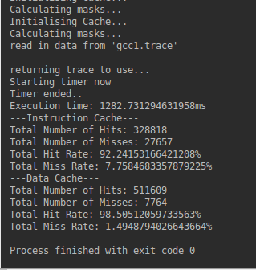

# Computer Architecture CS3421 - Tutorial 4#
## LKN Cache Simulation ##

### Description of Tutorial###

The purpose of this assignment is to model the operation of an LKN cache. For this model, we are to assume; and use, a
**L**east **R**ecently **U**sed;_LRU_, eviction policy. This program will be used to simulate a 16KB direct mapped
_instruction_; _L = 16, K = 1, N = 1024, cache and an 8-way 32KB data cache; _L = 16, K = 8, N = 256_.

In this program the data is read in from the **gcc1.trace** file; This file is a 16MB address trace file supplied by the
lecturer; Jeremy Jones. This address file contains all of the physical addresses accessed by an I486 microprocessor while
gcc was compiling a program.

### Description of Code ###

This program was written in the programming language **python 3.5.2**, the program was written and tested on my laptop.
#### Laptop specs ####
1.   Intel Core i7-6500
2.   8 GB RAM
3.   1 TB HDD
4.   OS - Linux Mint

This program has 3 files:
1.   main.py
2.   Cache.py
3.   CacheFunctions.py

1.   *main*.py

The *main.py* instantiates two versions of the cache object; these modelling *data* and *instruction* caches. This file
also measures the time taken to determine the number of hits and misses using the instruction and data caches. The results
obtained are also printed to terminal using this file.

2.   *Cache*.py

The cache file models a cache as an object. The cache object has the following attributes:
*   L = bytes per line, K = lines per set, N = number of sets in the cache,
*   lru_queue is used to store the cache tags for each set, cache_sets is used to store lines of tags in each set and is size K*N
*   cache_directories is used to store the byes per line and is size L * N * K.
*   tag_mask this is used to calculate the tag to analyse, set_mask this is used to calculate the set to analyse
*   offset_mask used the calculate the offset of bits determined to read from cache
*   set_shift is used to calculate the set number by shifting the and'd result of the address and the set_mask
*   tag_shift is used to calculate the tag by shifting the and'd result of the address and the tag_mask
*   total_hits = total number of hits in the cache, total_misses = total number of misses in the cache

The cache object has 4 main functions. these are:
1.   **calculating_masks**
     *   This function is used to calculate the masks for offset_mask, tag_mask and set_mask, which will be used in turn
         later to compute values for the offset_value, tag_index and set_number when reading instructions from the addresses
         _See function below._
2.   **read_instruction_from_address**
     *   This function can be split into two sections, one is for a cache hit, the other a cache miss.
         This function is used to read in the instruction from a given address from the trace. The offset, set_number
         and tag are calculated.
     *   If the tag is present in the cache_sets, a cache hit has occurred. In which case, the tag
         value is removed from the queue *lru_queue* and is appended to the top of the queue, to represent that it's the most recently used
         value.
     *   Otherwise a cache miss has occurred; the tag is not present in the cache. Hence, this tag has to be read into
         the cache line. This update occurs in the *else:* section of the if, else section of this program. When updating the
         tag index; *new_tag*, we try to use the set_number obtained at the start of the function, if a valueError occurs when
         obtaining the value for the *new_tag*, the tag value in that set is popped, and is uses to determine the new_tag index.
         This value is then used to update the cache.

3.   *CacheFunctions*.py

There are two functions used in this file, they areL
1.   *analyse_the_trace*
     *   This function is takes in the trace addresses; read in and parsed from the trace file, and the two caches; the data cache
         and the instruction cache.
2.   *read_trace_from_file*
     *   This function is called when we are reading in the data from the trace file; *'gcc1.trace'*

## Results ##
Using the machine with the specs I have highlighted above in *Laptop specs*, the results I achieved are highlighted in the
image below.

The number of hits and misses obtained for the instruction cache are: *328780* and *27695* respectively
The number of hits and misses obtained for the data cache are: *511464* and *7909* respectively
The time taken to compute the above metrics was 1503.2337 ms. This time was significantly larger than the time expected
for this program. The expected time taken for this program was 100ms. Hence, my solution, on my machine is 15X the expected
time.